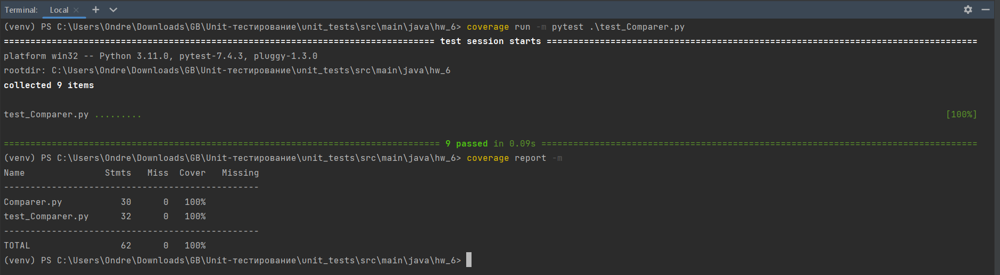

#### Сценарии тестов:
- проверка сравнивания средних значений корректно введеных списков, заполненных
числами;
- проверка сравнивания средних значений списков, один из которых пустой;
- проверка расчета средних значений списков, один из которых пустой;
- проверка возникновения исключения при вводе типа данных, отличного от списка;
- проверка возникновения исключения при вводе списков, один из которых содержит 
не только числовые типы данных;
- проверка корректного вывода на печать сообщения после сравнения средних значений;

*Данные сценарии учитывают и проверяют все возможные варианты правильного и 
неправильного использования программы, а также покрывают весь код и все функции
приложения.*

#### Покрытие:
